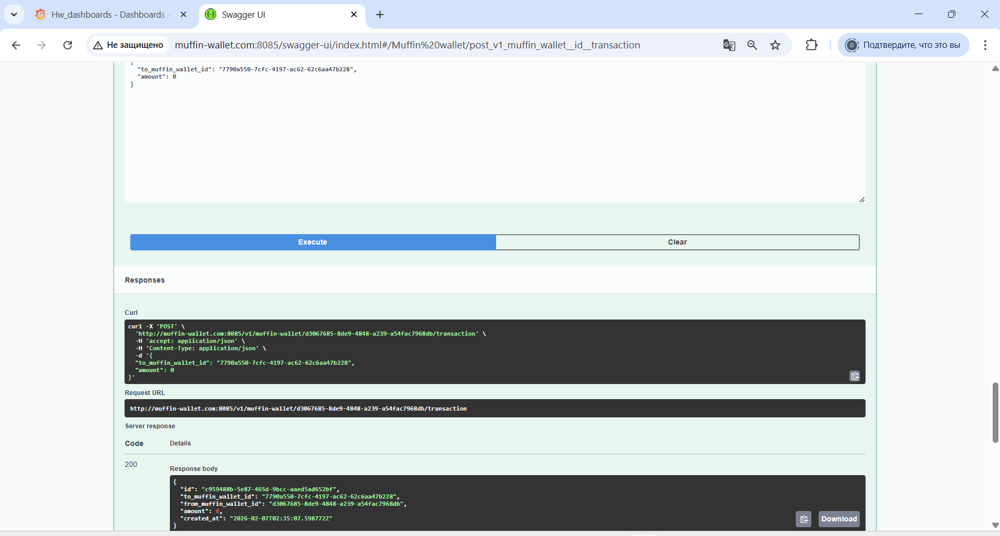
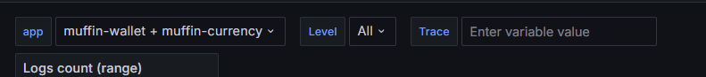
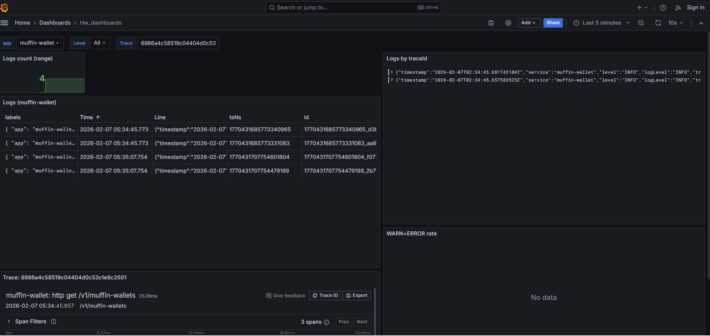
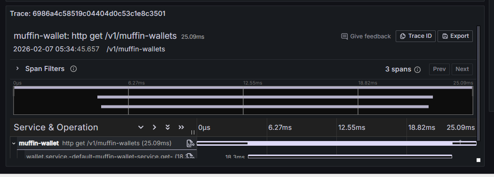
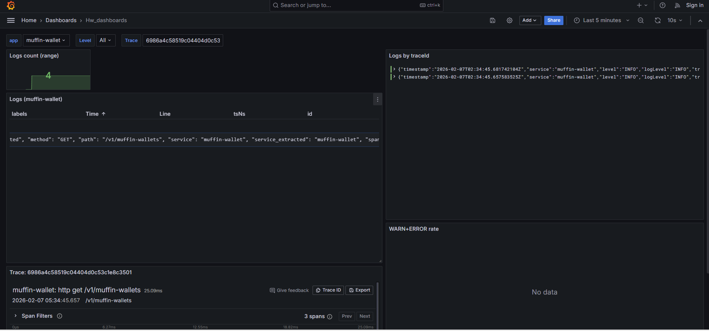
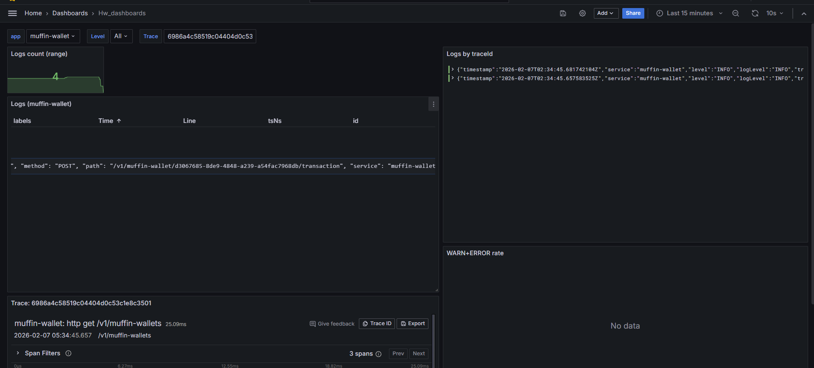

# HW Tracing

helm манифесты приложений лежат в папке helm.
Устанавливаются командами:


```
helm upgrade --install postgres        ./helm/postgres-chart        -n default
helm upgrade --install muffin-wallet   ./helm/muffin-wallet-chart   -n default
helm upgrade --install muffin-currency ./helm/muffin-currency-chart -n default
```

Сначала база, потом приложения.

Потом ставим observability:

```
kubectl apply -f observability/00-namespace.yaml
kubectl apply -f observability/loki
kubectl apply -f observability/tempo
kubectl apply -f observability/grafana
```

Всё развёрнуто в k8s. Постоянное хранение через PVC.

Порт wallet поменял в приложении на 8085, так как у меня 8080 на
компьютере занят докером, его непонятный cAdvicor, не смог его
удалить.

Прописан url в host, так что обращение через него. 



Транзация работает, всё ок.

Посмотрим можно ли смотреть логи и трейсы

Графана на 3000 порту. Дэшборд прикрепил json файлом.



3 переменные сделал: приложение, уровень, id трейса.
И на дэшборде 

Сделал количество логов за выбранное время, сами логи по фильтрам,
Трейсы по id, визуализация трейса.


Заметим, что метод wallet, который я вызвал для демонстрации,
попал в логи: 

И транзакция тоже: 

